Assignment 3
===================================
Submission By: 
Vineet Kumar Singh (UID: 119123614)

##  1. Differentiable Volume Rendering
You can run the code for part 1 with:

```bash
python main.py --config-name=box
```

The results will be saved in `images/part_1.gif`.

##  2. Optimizing a basic implicit volume

Train the model by running the code: 

```bash
python main.py --config-name=train_box
```

The code renders a spiral sequence of the optimized volume in `images/part_2.gif`.

The results for before and after training are also stored in `images` folder


##  3. Optimizing a Neural Radiance Field (NeRF)

Run the below to train the NeRF and estimate the results. 
```bash
python main.py --config-name=nerf_lego
```

After training, a spiral rendering will be written to `images/part_3.gif`.


# Results: 
## Section 1: Differentiable Volume Rendering
-------------------------------------------------------------------------------

## Subsection 1.3: Ray Sampling

My results
|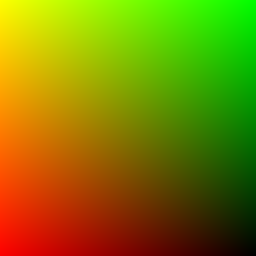 | 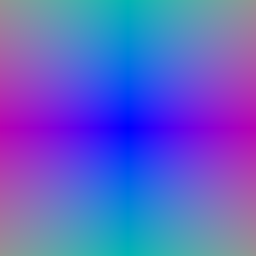 |
| --- | --- |
|Grid Visualization | Ray Visualization| 

TA Results
|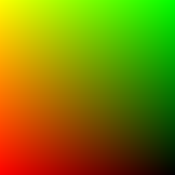 | 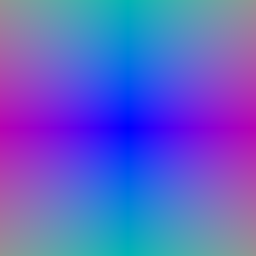 |
| --- | --- |
|Grid Visualization | Ray Visualization| 


## Subsection 1.4: Point Sampling

|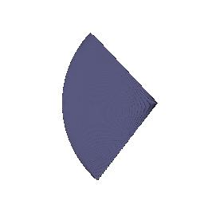 |  | 
| --- | --- |
| Point Sampling (My result) | Point Sampling (TA result) |


## Subsection 1.5: Volume Rendering

My results
|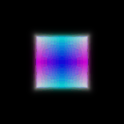 | 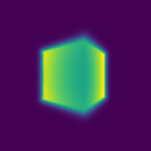 |
| --- | --- |
|Colour Rendering | Depth Rendering| 

TA Results
| |  |
| --- | --- |
|Colour Rendering | Depth Rendering| 


# Section 2: Optimizing a basic implicit volume
-------------------------------------------------------------------------------

## Subsection 2.2: Loss and Training

|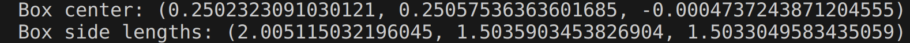| 
| --- |
|Box Centre and Side Lengths| 


| 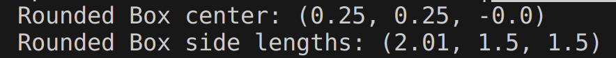 |
| --- |
|Box Centre and Side Lengths rounded to 1/100 | 


## Subsection 2.3: Visualization

|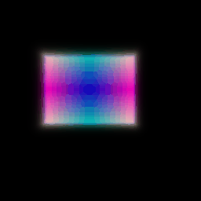 |  | 
| --- | --- |
| Visualization (My result) | Visualization (TA result) |


# Section 3: Optimizing a Neural Radiance Field (NeRF)
-------------------------------------------------------------------------------
The model is trained for 251 epochs with batch size of 1024. \
The result of rendering is as shown below.

|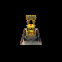 |  | 
| --- | --- |
| Final NeRF render (My result) | Final NeRF render (TA result) |

The code for this section (section 3) is referred and adapted from the following sources:
1. [Facebook Research PyTorch3D Nerf Repository](https://github.com/facebookresearch/pytorch3d/tree/main/projects/nerf/nerf) (Referred for functions of colour and densities)
2. [Andrew CMU Course Project 3](https://www.andrew.cmu.edu/course/16-825/projects/dkalaria/proj3/) (MLPwithskip model is referred from this)

In addition to the result, I also saved the results of render for intermediate epochs to see how the quality of render evolve with epochs.

|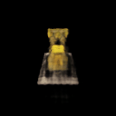 | 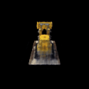 | 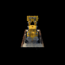 |
| --- | --- | --- |
|10 epochs |20 epochs |50 epochs 
| | 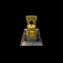 | 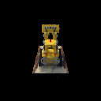 |
|100 epochs |150 epochs |200 epochs 

We can see that the result of training after 150 epochs is almost the same (visual comparison) compared to results at 250 epochs. 


The code for this section (section 3) is referred and adapted from the following sources:
1. https://github.com/facebookresearch/pytorch3d/tree/main/projects/nerf/nerf (Referred for functions of colour and densities)
2. https://www.andrew.cmu.edu/course/16-825/projects/dkalaria/proj3/ (MLPwithskip model is referred from this)


